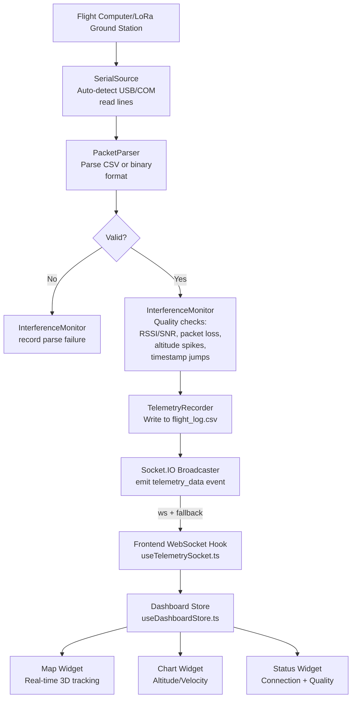

# ARD Ground Station Dashboard

Browser-based ground station dashboard for a hobby rocket club with real-time 3D rocket trajectory visualization.

## Features

- **3D Flight Visualization**: Real-time 3D map with Mapbox GL showing the rocket's position, flight path, and terrain
- **3D Terrain Integration**: Rendered topographic terrain with 1.5x exaggeration for flight profile visibility
- **Dark Theme Map**: Minimalist dark-themed map interface optimized for night launches
- **Draggable Widgets**: Fully flexible dashboard with drag, resize, dock, and fullscreen controls
- **Real-time Telemetry**: Socket.IO-based telemetry stream with 10+ Hz updates
- **Data Quality Monitoring**: Automatic interference detection (packet loss, RSSI/SNR warnings, anomalies)
- **Flight Logging**: Automatic CSV recording of all telemetry with quality metrics
- **Serial Port Management**: Auto-detection and open/close control for LoRa/USB/serial inputs
- **Charts & Analytics**: Live altitude and velocity trend charts
- **Status Widget**: Real-time connection state and telemetry diagnostics
- **Responsive Design**: Works on desktop and tablet browsers

## What is in this scaffold

- React + TypeScript frontend with a flexible widget-based dashboard
- Flask + Socket.IO backend with real-time telemetry broadcasting
- Mapbox GL for 3D Earth visualization with terrain and 3D flight trajectories
- Modular telemetry pipeline: serial source → parser → quality monitor → recorder
- Widget system with drag, resize, dock, and fullscreen behavior
- Production-ready data validation and interference monitoring

## Project layout

```
backend/
  app/
    main.py              # Flask app + Socket.IO handlers
    models.py            # Telemetry data models (legacy, can remove)
    telemetry.py         # Simulated telemetry (legacy, can remove)
    pipeline/
      serial_source.py   # Serial port management + auto-detection
      packet_parser.py   # CSV and binary packet parsing
      telemetry_schema.py # TelemetryFrame dataclass
      quality.py         # InterferenceMonitor for data validation
      recorder.py        # Flight log CSV writer
      telemetry_pipeline.py # Main pipeline orchestrator
  requirements.txt       # Python dependencies

frontend/
  src/
    components/          # Dashboard widgets
      MapWidget.tsx      # Mapbox GL 3D map with terrain
  hooks/
    useTelemetrySocket.ts # Socket.IO client hook
    useTelemetryFeed.ts  # Data processing
    useTelemetryPlayback.ts # Playback controls
  store/
    useDashboardStore.ts # Zustand state management
  types/
    telemetry.ts        # TypeScript types
  package.json
```

## Telemetry Shape

The telemetry packet structure:

```c
struct TelemetryPacket {
  uint32_t time;        // milliseconds since launch
  float altitude;       // meters AGL
  float bmpTemp;        // celsius
  float imuTemp;        // celsius
  float pressure;       // pascals
  float accX, accY, accZ;
  float angVelX, angVelY, angVelZ;
} __attribute__((packed));
```

Optional LoRa fields (if available):
- `rssi` - Received Signal Strength Indicator
- `snr` - Signal-to-Noise Ratio  
- `packet_id` - For packet loss detection

The backend enriches each packet with derived flight values:
- `latitude`, `longitude` (computed from downrange ballistics)
- `velocity` (m/s)
- `azimuth_deg` (0-360°)
- `quality_status` ("OK", "WARN", "BAD")
- `warnings` (list of detected anomalies)

## Telemetry Data Pipeline



### Pipeline Stages

1. **Serial Ingestion** - `SerialSource` auto-detects available COM/USB ports and reads telemetry lines
2. **Packet Parsing** - `PacketParser` decodes CSV lines into `TelemetryFrame` objects
3. **Quality Monitoring** - `InterferenceMonitor` validates data and detects:
   - Bad numeric values (NaN, Inf)
   - Out-of-range pressures/altitudes
   - Weak RSSI or low SNR signals
   - Packet loss via packet ID sequencing
   - Duplicate packets
   - Telemetry dropouts (time gaps > 1s)
   - Altitude spikes (> 350 m/s)
   - Acceleration spikes (> 200 m/s²)
4. **Flight Logging** - `TelemetryRecorder` appends all packets to `flight_log.csv`
5. **Real-time Broadcast** - Flask/Socket.IO emits validated telemetry to all connected clients
6. **Frontend Store** - Zustand store buffers history (500 samples) and updates UI
7. **Widget Rendering** - Map, charts, and status widgets subscribe to store changes

## Run Locally

### Prerequisites

- **Node.js 18+** and npm for the frontend
- **Python 3.9+** for the backend
- **Mapbox token** for the map (free tier available at https://account.mapbox.com/)

### Backend Setup

```bash
cd backend

# Create and activate virtual environment
python -m venv .venv
source .venv/bin/activate  # On Windows: .venv\Scripts\activate

# Install dependencies
pip install -r requirements.txt

# Run Flask server
flask --app app.main run
# Or with auto-reload:
flask --app app.main run --debug
```

Backend starts on `http://127.0.0.1:5000` with Socket.IO support.

### Frontend Setup

```bash
cd frontend

# Install dependencies
npm install

# Create .env.local with Mapbox token
echo "VITE_MAPBOX_TOKEN=your_mapbox_token_here" > .env.local

# Start dev server
npm run dev
```

Frontend starts on `http://localhost:5173` and auto-connects to `http://localhost:5000`.

## Using Real Telemetry

The backend is ready for real serial data. Two options:

### Option A: Serial Device (USB/LoRa radio)

1. Connect your ground station to USB/serial
2. The backend will auto-detect available ports on startup
3. Use the dashboard to select and open the port
4. Telemetry begins streaming immediately

### Option B: Simulated Telemetry (For Testing)

The old simulated telemetry is currently inactive. To re-enable it during testing, modify `backend/app/main.py`:

```python
# Add a fallback to simulation if no real serial data:
def fallback_simulation():
    from .telemetry import build_sample, sample_to_dict
    # ... emit simulated data
```

## REST API Reference

### Get Available Serial Ports
```
GET /ports
→ {"success": true, "ports": ["/dev/cu.usbserial-...", ...]}
```

### Set Serial Port
```
POST /set_port
{
  "port": "/dev/cu.usbserial-..."
}
→ {"success": true, "message": "..."}
```

### Open Serial Port (Starts Streaming)
```
POST /open_port
→ {"success": true, "message": "..."}
```

### Close Serial Port
```
POST /stop_port
→ {"success": true, "message": "..."}
```

### Get Latest Telemetry
```
GET /telemetry/latest
→ {"success": true, "data": {...telemetry frame...}}
```

### Get Telemetry History (Last 500 samples)
```
GET /telemetry/history
→ {"success": true, "data": [{...}, {...}, ...]}
```

### Get Quality Statistics
```
GET /telemetry/stats
→ {"success": true, "data": {
  "total_frames": 1205,
  "parse_failures": 2,
  "dropout_count": 0,
  "duplicate_count": 1,
  "missing_packets": 3,
  "packet_loss_percent": 0.25
}}
```

## Socket.IO Events

### Client → Server
- `request_telemetry` - Request immediate snapshot of last 100 samples + stats

### Server → Client
- `telemetry_data` - New telemetry frame (emitted at 10+ Hz)
- `pipeline_stats` - Updated quality statistics
- `port_opened` - Serial port successfully opened
- `connect` - Client connected to Socket.IO server
- `disconnect` - Client disconnected

## Flight Log Format

Every flight is automatically recorded to `flight_log.csv` with columns:

```
time,altitude,pressure,bmpTemp,imuTemp,accX,accY,accZ,angVelX,angVelY,angVelZ,rssi,snr,packet_id,received_at,quality_status,warnings
```

Use this for post-flight analysis, interference investigation, and sensor validation.

## Map Controls

- **Find Rocket** - Manually pan/zoom to current rocket position
- **Auto-follow (On/Off)** - Toggle automatic camera tracking
- **Pitch/Bearing** - Use mouse to rotate view; auto-adjusted based on flight azimuth
- **Flight Path** - Red line traces the rocket's trajectory with altitude encoding

## How Projects Continue

### Next: 3D Rocket Model

Replace the pulsing red dot with a 3D rocket model (GLB/GLTF format):

```typescript
// In MapWidget.tsx
map.addLayer({
  id: "rocket-3d",
  type: "model",
  source: "rocket-model",
  model: {
    uri: "/rocket_model.glb",
    scale: [10, 10, 10],
    rotation: [0, heading, 0],
  }
});
```

### Future Enhancements

1. **Predicted Landing Zone** - Ballistic trajectory prediction overlay on map
2. **Data Playback & Scrubbing** - Rewind/fast-forward through recorded flights
3. **Multi-flight Comparison** - Side-by-side altitude/velocity plots
4. **User Authentication** - Multi-operator workspaces with saved layouts
5. **Cloud Storage** - Export and archive flights
6. **Real-time Alerts** - Anomaly notifications (pressure spikes, signal loss, etc.)
7. **Hardware Integration** - Direct APIs for commercial ground stations (Eggtimer, Perfect Descent)

