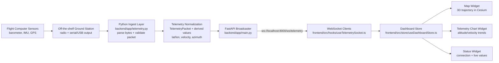

# ARD Ground Station Dashboard

Browser-based ground station dashboard for a hobby rocket club with real-time 3D rocket trajectory visualization.

## Features

- **3D Flight Visualization**: Real-time 3D map of Earth showing the rocket's position and flight path with altitude
- **Draggable Widgets**: Fully flexible dashboard with drag, resize, dock, and fullscreen controls
- **Real-time Telemetry**: WebSocket-based telemetry stream with 10 Hz updates
- **Charts & Analytics**: Live altitude and velocity trend charts
- **Standalone Pages**: View any widget as a dedicated full-page application
- **Responsive Design**: Works on desktop and tablet browsers

## What is in this scaffold

- React + TypeScript frontend with a flexible widget-based dashboard
- FastAPI backend with a realtime WebSocket telemetry stream
- Cesium.js for 3D Earth visualization and rocket trajectory tracking
- Widget system with drag, resize, dock, and fullscreen behavior
- Shared telemetry schema based on the provided `TelemetryPacket`

## Project layout

- `backend/` Python API and telemetry broadcaster
- `frontend/` Browser dashboard app

## Telemetry shape

The initial packet is modeled after:

```c
struct TelemetryPacket {
  uint32_t time;
  float altitude;
  float bmpTemp;
  float imuTemp;
  float pressure;
  float accX, accY, accZ;
  float angVelX, angVelY, angVelZ;
} __attribute__((packed));
```

The backend wraps that packet in a JSON envelope and adds derived flight values (latitude, longitude, velocity, azimuth) that are used to render the 3D rocket trajectory on the map.

## Telemetry data pipeline

The graph below shows how telemetry moves from an off-the-shelf ground station into the browser dashboard.



### Pipeline stages

1. Ground-station output is read by the Python backend from a transport like serial, USB, or radio bridge.
2. The ingest layer decodes raw bytes into the telemetry packet and rejects malformed frames.
3. The backend enriches each packet with derived flight values needed by the UI.
4. FastAPI pushes packets to connected clients over a WebSocket stream at telemetry rate.
5. The frontend WebSocket hook receives each message and updates shared dashboard state.
6. Widgets subscribe to store updates and render map, charts, and status in real time.

## Run locally

### Prerequisites

- Node.js 18+ and npm for the frontend
- Python 3.9+ for the backend

### Backend setup

```bash
cd backend
python -m venv .venv
source .venv/bin/activate
pip install -r requirements.txt
uvicorn app.main:app --reload --host 0.0.0.0 --port 8000
```

### Frontend setup

```bash
cd frontend
npm install
npm run dev
```

The frontend starts on `http://localhost:5173` and expects the backend at `http://localhost:8000` (WebSocket at `ws://localhost:8000/ws/telemetry`).

## How it works

- **Map Widget**: Uses Cesium.js to render a 3D Earth view with the rocket's real-time position and flight trajectory in 3D space (altitude included). The map automatically tracks the rocket as it flies and displays altitude, velocity, and azimuth in the caption.
- **Charts Widget**: Shows real-time altitude and velocity trends.
- **Status Widget**: Displays connection state and current telemetry values.
- **Telemetry Stream**: Backend broadcasts simulated telemetry at 10 Hz over WebSocket. Replace the simulated data in `backend/app/telemetry.py` with real hardware data when ready.

## Next steps

1. Connect real telemetry data from radio or serial input (replace simulated data in `backend/app/telemetry.py`).
2. Add landing zone prediction visualization overlay on the 3D map.
3. Add data logging to a database and playback/time-scrubbing capability.
4. Add user authentication and saved layouts for multi-operator workspaces.
5. Integrate with flight computer APIs or sensor drivers.
